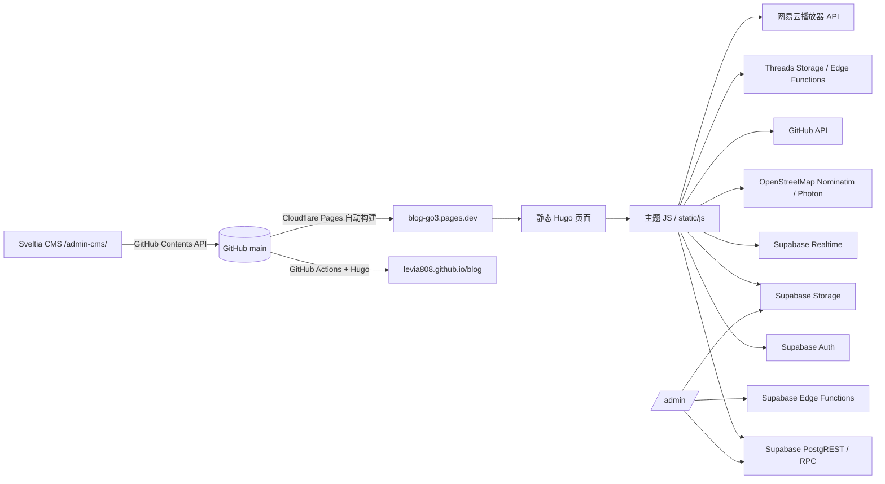

# Levia's Blog 项目总览与接口参考

> **文档版本**：2026-10-08
> **适用范围**：本仓库当前工作区的 Hugo 站点、Supabase 客户端与 SQL、Sveltia CMS、自定义管理后台、动态/评论、Threads 转发、网易云播放器及部署链路。
> **原则**：本文记录“当前仓库实际存在的实现”。历史设计稿、旧线程中提出但尚未落地的功能，会单独标注为“历史/计划”，不当作线上现状。

本文是项目的结构化索引，不替代源代码。接口行为发生变化时，应先修改源代码，再同步本文件。

---

## 0. 重要安全说明

本文**不记录任何真实凭证或用户数据**，包括：

- Supabase publishable/anon key 原文、service-role key、JWT；
- GitHub PAT、OAuth secret；
- Threads `sessionid`、Cookie、账号密码及浏览器 profile；
- 网易云 Cookie、`.netease-session.json` 内容；
- Codex 原始 session JSONL、浏览器调试数据和真实线上用户/评论/媒体数据。

文中只记录变量名、文件位置、接口用途和权限边界。需要恢复或部署时，凭证应通过 Supabase Dashboard、Cloudflare/GitHub Secrets、服务器环境变量或本地受保护配置注入。

---

## 1. 项目速览

| 项目 | 当前值 |
|---|---|
| 仓库 | `https://github.com/Levia808/blog` |
| 默认分支 | `main` |
| 主站 | `https://blog-go3.pages.dev/` |
| GitHub Pages 备用站 | `https://levia808.github.io/blog/` |
| 站点生成器 | Hugo Extended |
| 主题 | `themes/brutalism` |
| 主数据后端 | Supabase：认证、个人资料、评论、动态、互动、媒体库、审计 |
| 内容管理 | Sveltia CMS `/admin-cms/` + 自定义后台 `/admin/` |
| 主站部署 | Cloudflare Pages 连接 GitHub 仓库 |
| 备用部署 | GitHub Actions → GitHub Pages |
| 默认语言 | `zh-cn` |
| 主要前端运行方式 | Hugo 输出的静态 HTML + 原生 JavaScript |

### 1.1 当前工作区的 Git 状态说明

当前工作区 `/home/levia/文档/blog` 的 `.git` 是占位目录，普通 `git status` 可能提示“不是 Git 仓库”。恢复出的实际元数据位于：

```text
/tmp/blog-current-20261008/.git
```

如果必须检查恢复仓库，可使用：

```bash
git --git-dir=/tmp/blog-current-20261008/.git \
    --work-tree=/home/levia/文档/blog status --short --branch
```

本轮文档整理不包含提交或推送操作。

---

## 2. 总体架构



### 2.1 数据边界

- **Hugo/GitHub**：文章 Markdown、页面 Markdown、`data/*.yaml`、主题模板、静态资源、CMS 配置。
- **Supabase Database**：用户资料、动态、点赞、评论、审核、通知、审计和媒体索引。
- **Supabase Storage**：头像、后台媒体、Threads 转存资源。
- **外部服务**：GitHub OAuth/API、Nominatim、Photon、Google Translate 免费端点、Threads、网易云 API。
- **浏览器本地存储**：Supabase 持久化登录 session；CMS 字体 GitHub token 的键名为 `localStorage.blog_gh_publish_token`。本地媒体预览使用 Blob URL/Cache API 的局部缓存逻辑。

---

## 3. 目录与文件职责

```text
.
├── content/                         Hugo 内容
│   ├── posts/                       文章 Markdown
│   ├── about.md                     关于页
│   ├── moments.md                   动态页
│   ├── perception.md                感知页
│   ├── archives.md                  归档页
│   ├── search.md                    搜索页
│   ├── profile.md                   个人主页
│   ├── admin.md                     管理后台入口
│   └── login/_index.md              登录页
├── data/
│   ├── site.yaml                    站点设置
│   ├── welcome.yaml                 欢迎页参数
│   ├── cards.yaml                   首页卡片样式
│   └── player.yaml                  播放器配置
├── themes/brutalism/
│   ├── layouts/                     Hugo 模板、partial、shortcode
│   ├── assets/css/main.css          主样式
│   ├── assets/css/features.css      功能样式
│   ├── assets/css/swiss.css         瑞士风格/布局样式
│   └── static/js/theme.js           欢迎页、导航、卡片、目录、视频等交互
├── static/
│   ├── js/supabase.js               Supabase 客户端、Auth、Profile、Admin、评论、媒体
│   ├── js/auth-ui.js                登录弹窗、用户菜单、登出、权限显示
│   ├── js/comments.js                文章评论 UI
│   ├── js/moments.js                动态、互动、地点、Threads 卡片
│   ├── js/profile.js                个人主页/资料保存
│   ├── js/admin.js                  自定义后台 UI 和行为
│   ├── admin-cms/                   Sveltia CMS 与配置
│   ├── float-player/                悬浮播放器
│   ├── fonts/                       自托管字体与 Phosphor 字体资源
│   ├── images/                      静态图片、视频、字体
│   ├── favicon.svg                  站点图标
│   └── vendor/liquidlens/           液态玻璃相关静态资源
├── threads-repost/
│   ├── fetch.mjs                    Threads 抓取脚本
│   ├── bridge/                      本地 Chrome CDP Cookie 桥
│   └── supabase/functions/          Threads/后台 Edge Functions
├── music-api/                       网易云播放器服务
├── float-player/netease-proxy/      历史本地网易云代理
├── supabase-*.sql                   Supabase 建表、RPC、RLS、修复脚本
├── design-*.html                    历史设计稿，不属于生产路由
├── .github/workflows/deploy.yml     GitHub Pages 构建部署
├── .github/gen-fonts.py             构建时生成字体清单
├── .github/transcode.py             构建时视频转码
├── hugo.yaml                        Hugo 主配置
├── PROJECT.md                       项目移植说明
├── RECOVERY_NOTES.md                恢复和交接记录
├── CODEX_CONTEXT_INDEX.md           本地恢复索引（不含原始会话）
└── PROJECT-API-REFERENCE.md         本文档
```

### 3.1 历史设计稿的边界

以下文件是设计/验证稿，不是当前生产路由：

```text
design-pwa-mobile-refresh-v1.html
design-pwa-navigation-v1.html
design-mobile-more-menu-v1.html
design-loader.html
design-home.html
```

除非代码明确引用，否则不能把设计稿中的 PWA、离线队列、任务栏或 UI 状态当作生产功能。

---

## 4. Hugo 页面与路由

| 路由 | 来源 | 说明 |
|---|---|---|
| `/` | `themes/brutalism/layouts/index.html` | 欢迎页、文章卡片、全屏/精选/网格/横向卡片 |
| `/posts/<slug>/` | `content/posts/*.md` + `_default/single.html` | 文章正文、目录、评论、上一篇/下一篇 |
| `/moments/` | `content/moments.md` + `_default/moments.html` | 动态时间线和发布器 |
| `/perception/` | `content/perception.md` + `_default/perception.html` | 感知页 |
| `/archives/` | `content/archives.md` + `_default/archives.html` | 归档 |
| `/search/` | `content/search.md` + `_default/search.html` | Fuse.js 搜索 |
| `/tags/` | Hugo taxonomy | 标签列表/详情 |
| `/about/` | `content/about.md` + `_default/plain.html` | 关于 |
| `/profile/` | `content/profile.md` + `_default/profile.html` | 当前用户资料 |
| `/login/` | `content/login/_index.md` + `_default/login.html` | 登录页/登录入口 |
| `/admin/` | `content/admin.md` + `_default/admin.html` | 自定义管理后台，要求 active superadmin |
| `/admin-cms/` | `static/admin-cms/index.html` | Sveltia CMS |

### 4.1 全站公共脚本加载顺序

`themes/brutalism/layouts/partials/scripts.html` 负责加载：

1. Supabase UMD 客户端；
2. `static/js/supabase.js`；
3. `auth-ui.js`；
4. `comments.js`；
5. 悬浮播放器；
6. `moments.js`；
7. `profile.js`；
8. `admin.js`；
9. 主题交互和必要的第三方库。

脚本通常通过 Hugo `relURL` 输出；动态页和后台部分脚本带 `now.Unix` 查询参数进行缓存破坏。

---

## 5. 构建与部署

### 5.1 本地构建

```bash
export PATH="$HOME/.local/bin:$PATH"
hugo server --port 1450 --bind 127.0.0.1
hugo --minify
```

本地预览常用地址：

```text
http://127.0.0.1:1450/
```

### 5.2 GitHub Actions

文件：`.github/workflows/deploy.yml`

触发条件：

- push 到 `main`；
- 手动 `workflow_dispatch`。

构建步骤：

1. `actions/checkout@v5`，递归检出子模块；
2. `peaceiris/actions-hugo@v3` 安装最新 Hugo Extended；
3. `python3 .github/gen-fonts.py`：扫描字体并更新/发布字体清单；
4. `python3 .github/transcode.py`：将不兼容的视频转为 H.264，并尽可能使用 faststart；
5. `hugo --minify --baseURL https://levia808.github.io/blog/`；
6. 上传 `public/` artifact；
7. `actions/deploy-pages@v4` 部署 GitHub Pages。

### 5.3 双线部署注意事项

- GitHub Pages 是显式定义在仓库 workflow 中的部署链路。
- `blog-go3.pages.dev` 是 Cloudflare Pages 主站，通常连接同一仓库并在 push 后自行构建。
- 两边的 `baseURL` 不同：主站为根路径，GitHub Pages 带 `/blog/` 前缀。
- OAuth 回调会根据 `window.location.hostname` 区分这两种路径。
- 如果主站没有更新，先检查 Cloudflare Pages 的构建日志和绑定分支；不要仅凭 GitHub Actions 成功判断 Cloudflare 已更新。

---

## 6. CMS（Sveltia CMS）

配置文件：`static/admin-cms/config.yml`

### 6.1 GitHub 后端

```yaml
backend:
  name: github
  repo: Levia808/blog
  branch: main
  base_url: https://sveltia-cms-auth.18013013170.workers.dev
```

保存行为：

- 保存即向 GitHub `main` 提交文件；
- Cloudflare Pages 和 GitHub Actions 随后触发构建；
- 文章 `draft: true` 为草稿，不应显示在站点；
- `draft: false` 才是发布状态。

媒体配置：

```yaml
media_folder: assets/images
public_folder: /images
```

CMS 媒体进入仓库 `assets/images`，由 Hugo Pipes/构建脚本处理；后台 Supabase 媒体上传则进入 Supabase Storage，两者不是同一条链路。

### 6.2 CMS 集合

1. **卡片样式**：`data/cards.yaml`
   - `fullscreen`
   - `feature`
   - `grid`
   - `horizontal`

2. **站点设置**：`data/site.yaml`
   - 作者、导航 Logo、导航行为；
   - 欢迎页头像、描述、关键词；
   - 登录/评论/目录/阅读时间/字数/面包屑/上一篇下一篇开关；
   - 社交图标。

3. **欢迎页配置**：`data/welcome.yaml`
   - 打字机：`typewriterText`、`typeSpeed`、`deleteSpeed`、`pause`；
   - 标题字重：`titleVariationFrom`、`titleVariationTo`；
   - 指针/磁性/形状参数：`proximityRadius`、`proximityFalloff`、`shapeSize`、`roundness`、`borderSize`、`circleSize`、`circleEdge`；
   - 粒子参数：`sparkColor`、`sparkSize`、`sparkRadius`、`sparkCount`、`sparkDuration`、`sparkEasing`、`sparkExtraScale`。

4. **文章**：`content/posts/`
   - 标题、日期、草稿、归档、标签、分类、描述、背景；
   - 全屏入口标题的字体文件、名称、颜色、不透明度、字号、效果、隐藏标题、乱码、对齐；
   - `cover.image`、`cover.video`；
   - Markdown 正文。

5. **页面**：`content/`
   - 标题、草稿、`layout: page`、Markdown 正文。

### 6.3 CMS 维护硬规则

- `cover.video` 的 `accept` 必须是**字符串**，当前正确形态为：

  ```yaml
  accept: ".mp4,.webm,.mov"
  ```

- `widget: number` 使用小数默认值时，必须配置 `value_type: float`；例如 `shapeSize: 1.2`、`roundness: 0.4`、`borderSize: 0.05`、`circleSize: 0.55`、`circleEdge: 0.35`。
- 修改 `config.yml` 后先做 YAML 解析和 Hugo 构建，再让 CMS 提交。
- CMS 字体上传使用浏览器 `localStorage.blog_gh_publish_token`，本文不记录 token 值；应考虑迁移到更安全的 OAuth/代理流程。
- Sveltia 自定义字体控件依赖内部 React 渲染，源代码注释已说明不要额外引入不兼容的 React。

---

## 7. Supabase 客户端与认证

客户端文件：`static/js/supabase.js`

### 7.1 客户端初始化

- Supabase URL 在 `SUPABASE_URL` 常量中；当前项目 URL 可从该文件读取。
- publishable/anon key 在 `SUPABASE_ANON_KEY` 常量中。本文不重复真实值。
- 客户端对象：`window.blogSupabase`。
- Auth 配置：
  - `autoRefreshToken: true`
  - `persistSession: true`
  - `detectSessionInUrl: true`
  - `storage: window.localStorage`

如果 Supabase UMD 客户端不存在，代码会安装降级对象：认证方法返回空用户或“登录服务暂不可用”，并将 `Profile`、`Admin`、`MediaService`、`CommentService` 设为空/不可用。

### 7.2 `Auth` API

| 方法 | 参数 | 行为/返回 |
|---|---|---|
| `Auth.user()` | 无 | `auth.getUser()`，返回当前用户或 `null` |
| `Auth.session()` | 无 | `auth.getSession()`，返回 session 或 `null` |
| `Auth.signUp(email, password, displayName)` | 邮箱、密码、显示名 | `auth.signUp`，显示名写入 `user_metadata` |
| `Auth.signIn(email, password)` | 邮箱、密码 | `auth.signInWithPassword` |
| `Auth.signInWithGitHub()` | 无 | GitHub OAuth，scope `read:user user:email` |
| `Auth.signOut()` | 无 | 注销当前会话 |
| `Auth.resetPassword(email)` | 邮箱 | 发送重置邮件 |
| `Auth.onAuthChange(callback)` | 回调 | 订阅 Supabase Auth 状态变化 |

OAuth/密码重置回调：

- 主站：`<origin>/profile/`；
- GitHub Pages：`<origin>/blog/profile/`。

### 7.3 用户角色与状态

角色：

```text
user / author / admin / superadmin
```

账号状态：

```text
active / suspended / deleted
```

动态发布要求 `author` 或 `superadmin`；自定义后台当前门禁要求 `superadmin + active`。

---

## 8. Profile API（个人资料）

对象：`window.Profile`，实现位于 `static/js/supabase.js`。

公开字段集合：

```text
id, username, display_name, bio, avatar_url,
github_username, github_avatar_url, website,
created_at, updated_at
```

### 8.1 方法

| 方法 | 后端调用 | 说明 |
|---|---|---|
| `Profile.get(userId)` | 当前用户优先 `rpc('get_my_profile')`；否则 `profiles.select(...).eq('id', userId).single()` | 读取用户资料 |
| `Profile.getByUsername(username)` | `profiles.select(...).eq('username', username).single()` | 查不到时返回 `null` |
| `Profile.update(userId, updates)` | `profiles.update(payload).eq('id', userId).select(...).single()` | 仅允许白名单字段 |
| `Profile.uploadAvatar(userId, file)` | Storage `avatars` 上传 + `Profile.update` | 图片、≤5 MB、同名覆盖、URL 加 `?v=` |
| `Profile.fetchGitHubAvatar(username)` | `GET https://api.github.com/users/{username}` | 返回头像和用户名映射，失败返回 `null` |
| `Profile.linkGitHub(userId, githubUsername)` | GitHub API + `Profile.update` | 同步 `github_username`、`github_avatar_url`、`avatar_url` |

个人可写字段白名单：

```text
username
display_name
bio
avatar_url
github_username
github_avatar_url
website
```

头像 Storage：

```text
bucket: avatars
path: {userId}/avatar.{ext}
```

数据库触发器会保护 `profiles.role` 和 `profiles.account_status`，普通用户不能通过个人资料更新自行提权或恢复账号。

---

## 9. 媒体上传接口（重点）

实现：`Admin.uploadMedia(file, onProgress)`，`window.MediaService = Admin`。

> 该接口是自定义后台和动态发布器共用的 Supabase Storage 上传链路；CMS 的 `assets/images` 上传不走此接口。

### 9.1 支持类型与限制

前端白名单：

- `image/*`
- `video/*`
- `audio/*`
- `font/*` 或 `.ttf/.otf/.woff/.woff2/.eot`

大小限制：

```text
最大 100 MB
```

数据库 `register_media_asset` 当前只允许 `image/*`、`video/*`、`audio/*`。因此：

> **已知风险**：前端白名单允许字体，但 `register_media_asset` RPC 会拒绝字体 MIME。后台对字体有另一条 GitHub `assets/images` 同步流程，字体应走该流程，而不是 Supabase `media` 媒体库。

### 9.2 上传流程

```text
Auth.user()
  → 校验类型/大小
  → 图片压缩为原图 + 预览图
  → 上传 media/{userId}/{timestamp}-{safeName}
  → 可选上传 preview-{safeName}
  → getPublicUrl
  → rpc register_media_asset
  → 成功返回媒体记录
```

原图压缩：

- 最长边 2560；
- WebP；质量 `0.88`。

预览图压缩：

- 最长边 600；
- WebP；质量 `0.70`；
- 预览副本不单独注册媒体库记录。

如果媒体记录注册失败，代码会尝试删除已上传的原图；预览副本是尽力清理，需定期检查孤儿文件。

### 9.3 Storage 路径

```text
bucket: media
original: {userId}/{timestamp}-{safeFileName}
preview:  {userId}/{timestamp}-preview-{safeFileName}
```

上传选项：

```js
{
  upsert: false,
  contentType: uploadFile.type,
  cacheControl: '3600',
  onUploadProgress
}
```

### 9.4 注册接口

```text
rpc register_media_asset(
  p_storage_path TEXT,
  p_file_name TEXT,
  p_mime_type TEXT,
  p_size_bytes BIGINT,
  p_public_url TEXT,
  p_metadata JSONB DEFAULT '{}'
) RETURNS media_assets
```

权限：active superadmin/admin（数据库函数当前使用 `is_admin()`，项目代码的后台页面实际只允许 superadmin 进入）。

---

## 10. 文章评论接口

对象：`window.CommentService`，实现仍在 `static/js/supabase.js`；文章评论 UI 在 `static/js/comments.js`。

### 10.1 前端 API

| 方法 | Supabase 调用 | 结果 |
|---|---|---|
| `CommentService.list(postPath)` | `comments.select(...profiles...).eq('post_path', postPath).order('created_at', ascending)` | 按时间升序的评论树原始节点 |
| `CommentService.create(postPath, content, parentId)` | 登录后 `comments.insert(payload).select(...).single()` | 新评论/回复 |
| `CommentService.update(commentId, content)` | `comments.update({content}).eq('id', commentId).select(...).single()` | 更新后的评论 |
| `CommentService.remove(commentId)` | `comments.delete().eq('id', commentId)` | `true` |
| `CommentService.report(commentId, reason)` | `rpc('report_comment', {p_comment_id, p_reason})` | Boolean |

查询的资料关联：

```text
profiles!comments_user_id_fkey(display_name, username, avatar_url)
```

### 10.2 规则

- 评论正文：前端限制 1–2000 字符；数据库/触发器会进一步校验。
- 创建评论必须登录。
- `parent_id` 支持树状回复。
- 评论作者可编辑、删除自己的评论；管理员可处理任意评论。
- 当前创建触发器默认将评论设为 `approved`，后台仍保留审核/举报模型。
- 频控：数据库脚本包含每 30 秒最多一条、每天最多 50 条的校验逻辑。

---

## 11. 动态（Moments）接口

主要文件：`static/js/moments.js`。

### 11.1 数据表

#### `moments`

```text
id          UUID PK
user_id    UUID -> profiles.id
content     TEXT
media       JSONB，URL 数组
location    JSONB，可选
visibility  public / whitelist / blacklist
visible_to  JSONB，用户 ID 字符串数组
hidden_from JSONB，用户 ID 字符串数组
created_at  timestamptz
updated_at  timestamptz
```

> 数据库字段实际为 `user_id`；本文其他地方使用“作者”时均指该字段。

#### `moment_likes`

```text
id UUID PK
moment_id UUID -> moments.id
user_id UUID -> profiles.id
created_at timestamptz
UNIQUE(moment_id, user_id)
```

#### `moment_comments`

```text
id UUID PK
moment_id UUID -> moments.id
user_id UUID -> profiles.id
content TEXT
parent_id UUID -> moment_comments.id，可选
created_at timestamptz
```

#### `moment_comment_likes`

```text
id UUID PK
comment_id UUID -> moment_comments.id
user_id UUID -> profiles.id
created_at timestamptz
UNIQUE(comment_id, user_id)
```

### 11.2 动态读写行为

| 功能 | 主要调用 | 权限/说明 |
|---|---|---|
| 加载列表 | `moments.select(...)`，失败时有查询字段降级重试 | 受可见性 RLS 过滤 |
| 发布 | `moments.insert({user_id, content, media, location}).select()` | `author`/`superadmin` |
| 编辑 | `moments.update({content, media, location, updated_at}).eq('id', id)` | 作者本人或管理员 |
| 删除 | `moments.delete().eq('id', id)` | 作者本人或管理员 |
| 可见性 | `moments.update({visibility, visible_to, hidden_from, updated_at}).eq('id', id)` | 当前 UI 仅 superadmin 展示入口 |
| 动态点赞 | `moment_likes.upsert(..., {onConflict:'moment_id,user_id'})` 或 delete | 登录用户只能操作自己的记录 |
| 动态评论 | `moment_comments.insert(payload).select(...).single()` | 登录用户，支持顶层评论/回复 |
| 评论点赞 | `moment_comment_likes.upsert(..., {onConflict:'comment_id,user_id'})` 或 delete | 登录用户只能操作自己的记录 |
| 删除动态评论 | `moment_comments.delete().eq('id', id)` | 评论作者或管理员 |

### 11.3 前端即时交互与失败回滚

动态点赞和评论点赞使用乐观 UI：

1. 先切换图标、文案和计数；
2. 异步发送 Supabase 写入；
3. 失败时恢复原状态并显示提示；
4. 成功后保持本地状态。

当前“发布动态”、上传媒体、编辑、删除、可见性保存仍然等待网络 Promise 完成后再更新服务端列表；**仓库当前没有实现历史计划中提到的 IndexedDB 后台同步队列**。

### 11.4 动态地点搜索

实现位于 `moments.js`，当前组合：

- 首选 Nominatim：`https://nominatim.openstreetmap.org`
- 备用/附近 POI：`https://photon.komoot.io`
- 地理编码语言：`zh-CN`；Nominatim 按公共实例规则做约 1 秒节流；
- 浏览器 GPS：`navigator.geolocation.getCurrentPosition`；
- 反向地理编码：Nominatim `/reverse`，失败回退 Photon；
- 搜索：Nominatim `/search?format=jsonv2&addressdetails=1&accept-language=zh-CN`，无结果回退 Photon；
- Photon 结果可调用 Google Translate 免费端点进行中文化；
- 结果会去重、过滤空名称，并限制结果数量；
- 网络请求包含超时保护。

存储格式：

```json
{
  "name": "地点名",
  "lat": 31.23,
  "lng": 121.47
}
```

### 11.5 动态媒体与缓存

- 发布器调用 `Admin.uploadMedia` 上传媒体。
- 动态图片支持预览图优先、原图回退。
- 当前代码有 Cache API 局部预览缓存和旧数据预览图补建逻辑。
- 历史动态缺少预览图时，管理员浏览可以在后台生成 600px WebP 预览。
- Threads 卡片媒体和动态普通媒体使用不同的查看器/缓存路径。

### 11.6 Realtime

`moments.js` 订阅 channel：

```text
moments-comments-live
```

当前监听：

- `public.moment_comments` 的 `INSERT`；
- `public.moment_comments` 的 `DELETE`。

前端会对本地刚插入的节点去重，避免 Realtime 事件和写入 Promise 同时追加两次。

---

## 12. Threads 转发系统

目录：`threads-repost/`

### 12.1 工作流

```text
动态正文识别 Threads URL
  → 读取 Supabase Storage threads-reposts/<postId>.json
  → 无 JSON 时检测本机 Cookie bridge
  → bridge 抓取帖子
  → threads-fetch Edge Function 转存媒体和 JSON
  → moments.js 渲染卡片
  → 任一环节失败则降级为普通链接
```

支持链接：

```text
https://www.threads.net/@user/post/ID
https://www.threads.com/@user/post/ID
```

### 12.2 JSON 结构

```json
{
  "url": "https://www.threads.net/@user/post/ID",
  "id": "ID",
  "author": "显示名",
  "handle": "user",
  "time": "原始时间",
  "text": "正文",
  "replies": [],
  "stats": {
    "likes": 0,
    "replies": 0,
    "reposts": 0
  },
  "media": [],
  "avatar": "公开头像 URL",
  "fetchedAt": "ISO 时间"
}
```

### 12.3 本地 Cookie bridge

目录：`threads-repost/bridge/`

默认：

```text
Chrome DevTools Protocol: 127.0.0.1:9222
bridge: 127.0.0.1:8788
```

端点：

| 端点 | 用途 |
|---|---|
| `GET /api/status` | 检测桥和调试浏览器状态 |
| `GET /api/open?url=...` | 打开 Threads URL |
| `GET /api/cookies` | 从 CDP 读取 Cookie（仅本机使用） |
| `GET /api/fetch?url=...` | 请求抓取 |
| `GET /api/close` | 关闭/清理浏览器会话 |

启动脚本：

```bash
./threads-repost/bridge/chrome-debug.sh
```

Windows 对应 `chrome-debug.bat`。

### 12.4 Supabase Edge Functions

目录：`threads-repost/supabase/functions/`

| Function | 用途 | 权限 |
|---|---|---|
| `threads-login` | 使用账号流程获取 Threads 登录态 | 函数内验证 Bearer token + active superadmin |
| `threads-fetch` | 抓取帖子、转存图片/视频、写入 `threads-reposts` | 函数内验证 Bearer token + active superadmin |
| `admin-create-user` | 后台创建账号 | active superadmin |
| `admin-update-profile` | 后台修改昵称/头像 | active superadmin |

`threads-repost/supabase/config.toml` 当前将相关函数配置为 `verify_jwt = false`，原因是客户端调用兼容性；**函数内部的 access token 和 profile 权限检查不能删除**。

部署示例：

```bash
cd threads-repost/supabase
supabase login
supabase functions deploy threads-login --project-ref <SUPABASE_PROJECT_REF> --no-verify-jwt
supabase functions deploy threads-fetch --project-ref <SUPABASE_PROJECT_REF> --no-verify-jwt
```

媒体处理：

- 支持顶层 `video_versions` 和 `image_versions2.candidates`；
- 下载并转存到 `threads-reposts`；
- 视频有约 40 MB 的保守限制；
- 公开读取 JSON/媒体；
- 临时 fbcdn URL 失效时应重新抓取迁移。

---

## 13. 自定义管理后台 `/admin/`

页面模板：`themes/brutalism/layouts/_default/admin.html`
行为脚本：`static/js/admin.js`
公共接口对象：`window.Admin`。

访问流程：

1. `Auth.user()`；
2. `Admin.profile()` 调用 `get_my_profile`；
3. 必须满足 `role === 'superadmin'` 且 `account_status === 'active'`；
4. 否则显示无权限状态。

后台面板：

```text
dashboard / posts / archive / comments / users / media / settings / platform / player
```

### 13.1 `Admin` API

| 方法 | 后端调用 | 权限/用途 |
|---|---|---|
| `Admin.profile()` | `rpc('get_my_profile')` | 读取当前管理员资料 |
| `Admin.isAdmin()` | `Admin.profile()` | 当前代码判断 active superadmin |
| `Admin.claimPrimarySuperadmin()` | `rpc('try_claim_primary_superadmin')` | 仅匹配主 GitHub 账号时认领超管 |
| `Admin.getAllUsers()` | `rpc('admin_list_users')` | 用户列表 |
| `Admin.getContent(status)` | `rpc('admin_list_content', {p_status})` | 内容列表 |
| `Admin.getAllPosts()` | `getContent()` | 文章兼容别名 |
| `Admin.getStats()` | `rpc('admin_dashboard_stats')` | 仪表盘计数 |
| `Admin.getComments(status)` | `rpc('admin_list_comments', {p_status})` | 评论审核列表 |
| `Admin.getReports(status)` | `rpc('admin_list_reports', {p_status})` | 举报列表 |
| `Admin.moderateComment(commentId,status,reason)` | `rpc('moderate_comment', {p_comment_id,p_status,p_reason})` | 评论审核 |
| `Admin.updateAccountStatus(userId,status)` | `rpc('admin_update_account_status', ...)` | 账号状态管理 |
| `Admin.updateRole(userId,role)` | `rpc('superadmin_update_role', ...)` | 角色管理 |
| `Admin.updateProfileOf(opts)` | Edge Function `admin-update-profile` | 修改其他用户头像/昵称 |
| `Admin.getUserActivity(userId)` | `rpc('admin_list_user_activity', {p_user_id})` | 用户全站行为时间线 |
| `Admin.createUser(opts)` | Edge Function `admin-create-user` | 新建账号，通常免邮箱确认 |
| `Admin.getAuditLogs(limit)` | `rpc('admin_list_audit_logs', {p_limit})` | 审计日志 |
| `Admin.getMedia()` | `rpc('admin_list_media')` | 媒体库 |
| `Admin.registerMedia(...)` | `rpc('register_media_asset', ...)` | 注册媒体索引 |
| `Admin.deleteMedia(mediaId)` | 查 `media_assets` → Storage 删除原图/预览 → `rpc('admin_delete_media')` | 删除媒体 |
| `Admin.confirmDialog(options)` | 前端弹窗 | 非后端接口 |
| `Admin.compressImage(file)` | Canvas/WebP | 非后端接口 |
| `Admin.uploadMedia(file,onProgress)` | Storage + `register_media_asset` | 见第 9 节 |

### 13.2 后台 GitHub 内容操作

`admin.js` 还直接调用 GitHub API，用于：

- 读取仓库文章 Markdown；
- 修改/发布/删除文章文件；
- 读取 `assets/images` 媒体；
- 字体文件上传到 `assets/images`；
- 更新 `static/fonts.json`；
- 读取导航行为配置。

GitHub token 的本地键名：

```text
localStorage.blog_gh_publish_token
```

不要将其值写入文档、提交或日志。

### 13.3 评论“批准”相关排查

后台批准按钮最终调用：

```text
rpc('moderate_comment', {
  p_comment_id: commentId,
  p_status: status,
  p_reason: reason || null
})
```

点击无反应时按此顺序排查：

1. 浏览器控制台是否存在 `Admin`/Supabase 加载错误；
2. 当前 session 是否有效；
3. `get_my_profile` 是否返回 `superadmin + active`；
4. `moderate_comment` 是否存在且签名为 `(BIGINT, TEXT, TEXT)`；
5. `moderation_status` 是否为 `pending/approved/rejected/hidden`；
6. 是否执行过 `supabase-fix.sql` / `supabase-fix2.sql`；
7. RLS、函数授权和审计写入是否报错；
8. 网络请求是否返回 Functions/PostgREST error。

---

## 14. Supabase 数据库模型

SQL 文件执行顺序建议：

```text
supabase-setup.sql
supabase-fix.sql
supabase-fix2.sql
supabase-moments.sql
supabase-moments-fix.sql
supabase-comments-thread.sql
supabase-moments-location.sql
supabase-moments-visibility.sql
supabase-admin-user-activity.sql
```

脚本目标是幂等，但线上已有函数、policy、Realtime publication 和数据仍应先在 Dashboard 核验。

### 14.1 核心表

#### `profiles`

```text
id UUID PK → auth.users(id)
username TEXT UNIQUE
display_name TEXT
bio TEXT
avatar_url TEXT
github_username TEXT UNIQUE
github_avatar_url TEXT
website TEXT
role TEXT
account_status TEXT
created_at / updated_at
```

#### `content_items`

```text
id UUID PK
post_path TEXT UNIQUE
title TEXT
author_id UUID
status draft / pending_review / published / archived / rejected
metadata JSONB
review_reason TEXT
reviewed_by UUID
reviewed_at
created_at / updated_at
```

#### `content_versions`

```text
id UUID PK
content_item_id UUID
version_number INTEGER
source_markdown TEXT
checksum TEXT
created_by UUID
created_at
UNIQUE(content_item_id, version_number)
```

#### `comments`

```text
id BIGINT
post_path TEXT
user_id UUID
content TEXT
parent_id BIGINT
moderation_status pending / approved / rejected / hidden
moderation_reason TEXT
moderated_by UUID
moderated_at
deleted_at
created_at / updated_at
```

#### `comment_reports`

```text
id BIGINT
comment_id BIGINT
reporter_id UUID
reason TEXT
status open / dismissed / actioned
resolved_by UUID
resolved_at
created_at
```

#### `moderation_queue`

评论和内容审核队列的数据库模型，具体由已执行的线上 SQL 版本为准。

#### `notifications`

```text
id UUID
recipient_id UUID
notification_type TEXT
title TEXT
body TEXT
metadata JSONB
read_at
created_at
```

#### `audit_logs`

```text
id BIGINT
actor_id UUID
action TEXT
entity_type TEXT
entity_id TEXT
metadata JSONB
created_at
```

#### `security_events`

```text
id BIGINT
user_id UUID
event_type TEXT
severity info / warning / critical
metadata JSONB
created_at
```

#### `media_assets`

```text
id UUID
storage_bucket TEXT
storage_path TEXT UNIQUE
file_name TEXT
mime_type TEXT
size_bytes BIGINT
public_url TEXT
uploaded_by UUID
metadata JSONB
created_at
deleted_at
```

动态表详见第 11 节。

### 14.2 RPC 清单

| RPC | 参数 | 返回/用途 |
|---|---|---|
| `set_updated_at()` | trigger | 自动更新时间 |
| `has_any_role(required_roles TEXT[])` | 角色数组 | 检查当前用户是否 active 且拥有任一角色 |
| `is_staff()` | 无 | `author` 或 `superadmin` |
| `is_admin()` | 无 | `superadmin` |
| `is_superadmin()` | 无 | `superadmin` |
| `handle_new_user()` | trigger | 新 Auth 用户自动创建 profile |
| `protect_profile_fields()` | trigger | 保护 role/status |
| `get_my_profile()` | 无 | 返回当前用户完整 profile |
| `try_claim_primary_superadmin()` | 无 | 主 GitHub 账号认领超管 |
| `validate_comment_submission()` | trigger | 评论长度/频率等校验 |
| `queue_comment_report(...)` | 举报参数 | 举报入队 |
| `write_audit_log(...)` | action/entity/metadata | 写审计日志，客户端直接调用权限受限 |
| `create_notification(...)` | 通知参数 | 创建通知，客户端直接调用权限受限 |
| `report_comment(p_comment_id BIGINT,p_reason TEXT)` | 评论 ID、原因 | 举报文章评论 |
| `mark_notification_read(p_notification_id UUID)` | 通知 ID | 标记已读 |
| `admin_dashboard_stats()` | 无 | 仪表盘 JSON 统计 |
| `admin_list_users()` | 无 | 用户列表 |
| `admin_list_comments(p_status TEXT DEFAULT NULL)` | 状态 | 评论审核列表 |
| `admin_list_reports(p_status TEXT DEFAULT 'open')` | 状态 | 举报列表 |
| `moderate_comment(p_comment_id BIGINT,p_status TEXT,p_reason TEXT)` | 评论、状态、原因 | 审核评论 |
| `admin_update_account_status(p_user_id UUID,p_status TEXT)` | 用户、状态 | 更新账号状态 |
| `superadmin_update_role(p_user_id UUID,p_role TEXT)` | 用户、角色 | 更新角色 |
| `admin_list_content(p_status TEXT DEFAULT NULL)` | 状态 | 内容列表 |
| `upsert_content_item(...)` | 路径、标题、作者、状态、metadata | 新建/更新内容索引 |
| `create_content_version(...)` | 内容 ID、Markdown、checksum | 新建内容版本 |
| `moderate_content(...)` | 内容 ID、状态、原因 | 内容审核 |
| `admin_list_audit_logs(p_limit INTEGER DEFAULT 100)` | 数量 | 审计日志，最大 500 |
| `register_media_asset(...)` | Storage 路径、文件名、MIME、大小、URL、metadata | 媒体入库 |
| `admin_list_media()` | 无 | 媒体库 |
| `admin_delete_media(p_media_id UUID)` | 媒体 ID | 软删除记录并清理 Storage |
| `admin_list_user_activity(p_user_id UUID)` | 用户 ID | 动态/点赞/评论/审计时间线 |

### 14.3 权限原则

- 管理 RPC 使用 `SECURITY DEFINER`，函数内再次检查 `is_admin()` 或 `is_superadmin()`。
- `write_audit_log`、`create_notification` 等内部函数不应向普通客户端开放任意执行能力。
- 普通用户只能通过 RLS 读写自己的资料、自己的点赞、自己的评论等。
- `profiles` 的角色/账号状态不能由普通用户直接更新。
- 动态的 select policy 在 `supabase-moments-visibility.sql` 后变为：

```text
管理员
OR public
OR whitelist 且 auth.uid() 在 visible_to
OR blacklist 且 auth.uid() 不在 hidden_from
```

---

## 15. RLS 与 Storage

### 15.1 文章评论 RLS

- 可见评论：公开读取可见状态；
- 插入：必须 authenticated；
- 更新/删除：评论作者本人，或管理员通过扩展 policy；
- 树状回复由 `parent_id` 外键和级联删除支持。

### 15.2 动态 RLS

- `moments`：公开/可见性读取；`author`/`superadmin` 发布；作者本人或管理员更新/删除；
- `moment_likes`：公开读取，登录用户只能插入/更新/删除自己的记录；
- `moment_comments`：公开读取，登录用户只能用自己的 `user_id` 插入；作者或管理员删除；
- `moment_comment_likes`：公开读取，登录用户只能操作自己的记录。

### 15.3 Storage buckets

| Bucket | 内容 | 访问/用途 |
|---|---|---|
| `avatars` | 用户头像 | 公开读取；用户上传/更新自己的路径 |
| `media` | 后台媒体和动态附件 | 管理员上传/管理；由 `media_assets` 建索引 |
| `threads-reposts` | Threads JSON、转存图片/视频 | 前端公开读取；抓取写入由 Edge Function 完成 |

实际线上 bucket、policy、publication 状态需以 Supabase Dashboard 为准；本地 SQL 只能说明预期结构。

---

## 16. 网易云播放器

### 16.1 推荐服务：`music-api/`

启动：

```bash
cd music-api
npm install
npm run check
npm start
```

默认端口：`4188`

环境变量：

```text
PORT
HOST
CORS_ORIGIN
NETEASE_COOKIE
NETEASE_COOKIE_FILE
```

公开接口：

| HTTP | 说明 |
|---|---|
| `GET /api/netease/status` | 网易云登录状态 |
| `GET /api/netease/login/qr` | 获取二维码登录信息 |
| `GET /api/netease/login/check?key=...` | 轮询二维码登录 |
| `GET /api/netease/logout` | 登出 |
| `GET /api/netease/playlist?id=3778678&limit=30&level=exhigh` | 获取播放列表与音频 URL |

播放列表响应结构：

```json
{
  "ok": true,
  "adapter": "...",
  "playlist": { "id": "...", "name": "...", "cover": "..." },
  "total": 0,
  "playable": 0,
  "skipped": [],
  "tracks": [
    {
      "id": 0,
      "name": "...",
      "artist": "...",
      "album": "...",
      "cover": "...",
      "url": "..."
    }
  ]
}
```

限制：`limit` 默认 30、最大 200；`level` 默认 `exhigh`。

### 16.2 历史本地代理

目录：`float-player/netease-proxy/`

- 默认绑定 `127.0.0.1:4188`；
- 可通过 `NETEASE_API_BASE` 转发到独立的 NeteaseCloudMusicApi；
- 会写入 `.netease-session.json`，该文件是敏感会话数据，不得提交或记录内容。

---

## 17. PWA / 离线能力现状

历史上下文中曾提出：独立 PWA、IndexedDB 任务队列、先本地响应后异步同步、Service Worker、自动更新、移动端 dock 等方案。

**截至本文日期，对当前工作区的实际检查结果：**

```text
不存在 static/sw.js
不存在 manifest.json / manifest.webmanifest
不存在 serviceWorker 注册代码
不存在 static/js/pwa-sync.js
不存在 IndexedDB 持久化写入队列
```

因此当前生产代码的真实边界是：

- Supabase session 使用 localStorage 持久化；
- 动态点赞部分使用前端乐观更新并失败回滚；
- 图片预览有局部 Cache API 逻辑；
- 关闭页面后，上传/发布/编辑不会由浏览器保证继续执行；
- 文章/动态页面切换不等于离线导航；
- 历史设计稿不代表已经安装 PWA 或已经实现后台同步。

若后续实现 PWA，应单独设计并测试：manifest、Service Worker、IndexedDB schema、用户会话隔离、重复提交幂等、附件持久化、失败恢复和 iOS/Android 独立窗口行为。

---

## 18. 环境变量与配置索引

### 18.1 生产/服务端变量

| 变量 | 使用位置 | 用途 |
|---|---|---|
| `SUPABASE_URL` | Edge Function/服务端 | Supabase 项目 URL |
| `SUPABASE_ANON_KEY` | Edge Function/服务端 | 以调用者身份验证 token |
| `SUPABASE_SERVICE_ROLE_KEY` | Edge Function 内部平台配置 | 仅服务端使用，绝不进入前端 |
| `PORT` | music-api/代理 | HTTP 端口 |
| `HOST` | music-api | 绑定地址 |
| `CORS_ORIGIN` | music-api | CORS 来源 |
| `NETEASE_COOKIE` | music-api/代理 | 网易云会话，敏感 |
| `NETEASE_COOKIE_FILE` | music-api/代理 | 会话文件路径，敏感 |
| `NETEASE_API_BASE` | 历史代理 | 上游网易云 API 地址 |
| `THREADS_COOKIE` | `threads-repost/fetch.mjs` 本地脚本 | Threads 抓取 Cookie，敏感 |

### 18.2 前端可见配置

- `SUPABASE_URL` 和 publishable/anon key 当前直接出现在 `static/js/supabase.js`；它们不应被误认为 service-role secret。
- OAuth redirect 根据主站/GitHub Pages 自动计算。
- `data/site.yaml`、`data/welcome.yaml`、`data/cards.yaml` 是构建期配置，不是数据库配置。

---

## 19. 本地开发、校验与发布检查

### 19.1 JavaScript 语法检查

```bash
for f in \
  static/js/moments.js \
  static/js/comments.js \
  static/js/profile.js \
  static/js/supabase.js \
  static/js/admin.js \
  themes/brutalism/static/js/theme.js \
  threads-repost/fetch.mjs \
  music-api/server.js \
  float-player/netease-proxy/server.js \
  scripts/start-netease-player.js; do
  node --check "$f" || exit 1
done
```

### 19.2 YAML 检查

```bash
python3 - <<'PY'
import yaml
for path in ['data/welcome.yaml', 'data/cards.yaml', 'data/player.yaml', 'data/site.yaml', 'static/admin-cms/config.yml']:
    with open(path, encoding='utf-8') as f:
        yaml.safe_load(f)
    print('OK', path)
PY
```

### 19.3 Hugo 构建

```bash
hugo --minify
```

构建必须无 ERROR。若本机 Hugo 不存在，先安装 Hugo Extended，并确认版本与 CI 兼容。

### 19.4 Git 检查

```bash
git diff --check

git --git-dir=/tmp/blog-current-20261008/.git \
    --work-tree=/home/levia/文档/blog status --short --branch
```

提交/推送前要考虑 CMS 是否刚向 GitHub `main` 自动提交，避免直接覆盖远端变更。

---

## 20. 故障排查索引

### 20.1 CMS 显示配置错误

重点检查：

- `file` widget 的 `accept` 是否是字符串；
- 小数默认值的 number widget 是否为 `value_type: float`；
- YAML 缩进和引号；
- CMS 读取的分支是否为 `main`；
- Cloudflare Pages 是否完成重新构建。

### 20.2 评论批准按钮无效

重点检查第 13.3 节的 RPC、签名、session、superadmin 状态、RLS、函数授权和浏览器 Network 响应。

### 20.3 媒体上传失败

按顺序检查：

1. 用户是否登录；
2. MIME/扩展名和 100 MB 限制；
3. `media` Storage policy；
4. `register_media_asset` 是否拒绝 MIME；
5. 是否产生原图已上传但 RPC 失败的孤儿文件；
6. 字体是否误走 Supabase 媒体库，应该改走 GitHub 字体同步流程。

### 20.4 动态发布显示“加载失败”

检查：

- 当前用户 profile 是否读取成功；
- 角色是否 `author`/`superadmin`；
- `moments` 表字段是否包含 `media`、`location`、`visibility` 等当前代码使用的字段；
- `moments_insert` RLS 是否使用 `is_staff()`；
- 动态附件上传是否先失败；
- 浏览器 Network 中 `moments.insert` 和 Storage upload 的真实响应；
- 地点搜索公共服务是否超时（地点失败不应阻断无地点发布）；
- `moments.js` 查询字段降级是否触发。

### 20.5 地点搜索不准确/无结果

- Nominatim 公共实例受速率限制，代码已串行节流；
- Photon 主要用于附近 POI 和备用结果；
- 优先传完整的中国省/市/区/地标关键词；
- GPS 权限被拒时使用文本搜索；
- 未找到精确地点时，前端可保留自定义地点文本，但最终 `location` 仍应保持 `{name,lat,lng}` 或明确为无坐标的扩展格式，修改 schema/渲染前先统一约定。

### 20.6 Threads 卡片降级为链接

- 检查 Storage `threads-reposts` 中对应 `<id>.json`；
- 检查本机 bridge 是否运行在 `127.0.0.1:8788`；
- 检查 Chrome CDP `127.0.0.1:9222`；
- 检查 Edge Function 权限和部署；
- 不要把 Cookie 直接粘贴到仓库、Issue 或文档。

### 20.7 主站和 GitHub Pages 内容不一致

- 检查远程 `main` 是否有 CMS 自动提交；
- 检查 GitHub Actions artifact 与 Cloudflare 构建日志；
- 检查两个站点的 base URL 和缓存；
- 必要时查看 Cloudflare Pages 当前部署 commit。

---

## 21. 当前实现与历史计划差异

| 主题 | 当前实际状态 | 历史计划/设计稿状态 |
|---|---|---|
| PWA manifest | 未发现 | 多次设计过 PWA UI |
| Service Worker | 未发现 | 曾计划自动更新/离线缓存 |
| IndexedDB 同步队列 | 未发现 | 曾计划覆盖动态、评论、点赞、上传等 |
| 上传后台继续 | 页面关闭后不保证 | 计划“下次打开恢复” |
| 点赞 UI | 动态页已做乐观更新 + 失败回滚 | 更完整的统一队列未实现 |
| 移动端 Dock | 生产状态以当前主题代码为准 | 设计稿有多个版本，不等于生产实现 |
| 液态玻璃/动效 | 仓库有 `static/vendor/liquidlens/` 资源 | 仅以生产模板引用为准 |
| Threads 抓取 | bridge/Edge Function 代码存在，依赖凭证和部署 | 不是无登录公共抓取 |

---

## 22. 数据恢复边界与本地线程索引

项目恢复相关信息在以下文件中：

```text
PROJECT.md
RECOVERY_NOTES.md
HANDOVER.md
CODEX_CONTEXT_INDEX.md
```

`CODEX_CONTEXT_INDEX.md` 只记录 Codex session 的位置、用途和脱敏索引，不应将原始 JSONL、浏览器 profile 或附件复制到仓库。

恢复顺序建议：

1. 以当前仓库源代码为第一事实来源；
2. 以 SQL 脚本确认预期 schema/RLS/RPC；
3. 在 Supabase Dashboard 核验线上真实 schema、Storage、Realtime、数据；
4. 在 Cloudflare Pages 和 GitHub Pages 核验部署 commit；
5. 只有在需要追溯历史行为时才读取 `/tmp/blog-codex-recovery/` 的脱敏索引；
6. 不把旧会话中的工具输出、设计稿或用户要求误当成当前线上功能。

---

## 23. 变更维护规则

每次增加/修改接口时，至少同步：

1. 前端对象方法表；
2. 对应 Supabase 表/RPC/Edge Function；
3. 权限与 RLS；
4. Storage bucket 和文件路径；
5. 错误处理和回滚行为；
6. 本地运行/构建命令；
7. 安全变量说明；
8. 当前实现与历史计划差异；
9. `git diff --check`、`node --check`、Hugo build 结果。

### 23.1 推荐的接口改动记录格式

```markdown
### YYYY-MM-DD · 变更标题

- 前端入口：`static/js/xxx.js` → `Object.method()`
- 数据库：`table` / `rpc()` / `Edge Function`
- 权限：谁可以读/写/删除
- 失败行为：回滚、重试、提示、孤儿资源清理
- 验证：执行过的命令与结果
- 部署：目标分支、构建结果、线上地址
```

---

## 24. 源码索引

| 主题 | 主要源文件 |
|---|---|
| Hugo 配置 | `hugo.yaml` |
| 站点内容/CMS | `content/`、`data/`、`static/admin-cms/config.yml` |
| 主题模板 | `themes/brutalism/layouts/` |
| 主题交互 | `themes/brutalism/static/js/theme.js` |
| Supabase 客户端 | `static/js/supabase.js` |
| 登录 UI | `static/js/auth-ui.js` |
| 文章评论 UI | `static/js/comments.js` |
| 动态 UI/API | `static/js/moments.js` |
| 个人资料 UI | `static/js/profile.js` |
| 后台 UI/API | `static/js/admin.js` |
| 数据库基础 | `supabase-setup.sql` |
| 数据库修复 | `supabase-fix.sql`、`supabase-fix2.sql` |
| 动态 schema | `supabase-moments.sql`、`supabase-moments-fix.sql`、`supabase-moments-location.sql`、`supabase-moments-visibility.sql` |
| 评论树 | `supabase-comments-thread.sql` |
| 用户行为 | `supabase-admin-user-activity.sql` |
| Threads | `threads-repost/` |
| 音乐 API | `music-api/` |
| GH Pages 部署 | `.github/workflows/deploy.yml` |
| 字体生成 | `.github/gen-fonts.py` |
| 视频转码 | `.github/transcode.py` |

---

**文档结束。**
